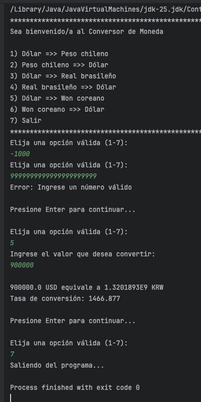

<h1 align="center">Conversor de Moneda</h1>

## Tabla de Contenidos
- [Descripción](#descripción)
- [Tecnologías](#tecmologías)
- [Funcionamiento](#funcionamiento)
- [ScreenShot](#screenshot)

## Descripción
* El programa convierte el valor de una moneda a otra mediante el uso de API, donde se consulta la tasa de conversión de cada moneda respecto de otra.
*   El programa cuenta con dos clases ConversorApp (clase principal) y ConsultaMoneda, y además de un record llamado Moneda.
* En ConversorApp se despliega el programa en si, es donde se capturan los valores desde pantalla para poder realizar la conversión de una moneda a otra.
Aquí es donde se despliega el menú que indica las diferentes opciones de conversión y dado el número de ingreso desde pantalla se le asignaran los valores
correspondientes a la moneda base y a la moneda que se desea convertir.
* En ConsultaMoneda se establecen la conexión a la API para obtener los valores de tasas de conversión. Para eso se creó un método para buscar la
tasa de conversión a partir de lo indicado por el usuario a través de pantalla. Devolviendo el valor anexo a dicha consulta.
* Conversor App se vincula a ConsultaMoneda mediante la creación de una instancia del record Moneda cómo se visualiza a continuación: 
***Moneda monedaConversion = consulta.buscaMoneda(monedaEntrada, monedaSalida);***
* record Moneda captura los datos provenientes de la API

## Tecnologías
1.  Java
2.  API : https://app.exchangerate-api.com/
3.  Postman
4.  Gson
5.  Git 
6.  Github

## Funcionamiento
* Al arrancar el programa se visualizan las opciones válidas para poder tener un correcto funcionamiento de este.
* En caso que el usuario no escoja una de las opciones válidas presentadas, la app continuará preguntando por una opción válida.
* Si el usuario ingresa un numero mas grande de lo que soporta el tipo de dato ***int***, explica el error y el ciclo vuelve a comenzar cuando damos enter.
* Al elegir un número válido entre [1,6] correspondiente al menú se procede a consultar el monto del valor a convertir.
* Si elige la opción 7, el programa termina.

## ScreenShot

